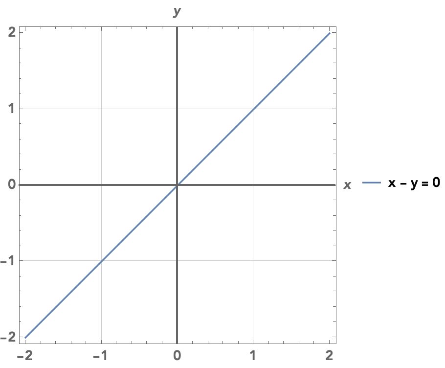
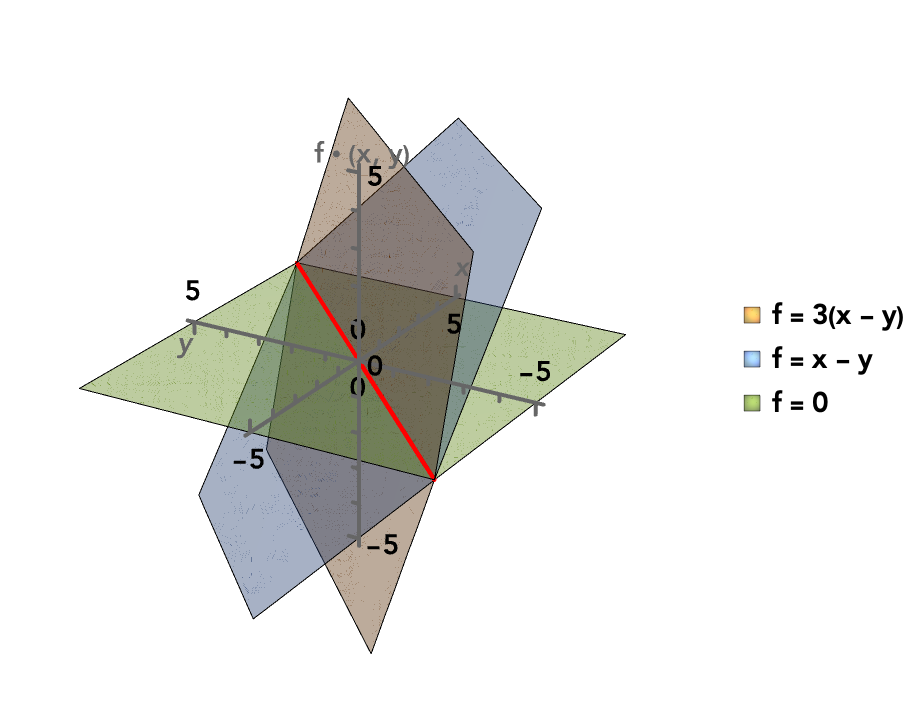
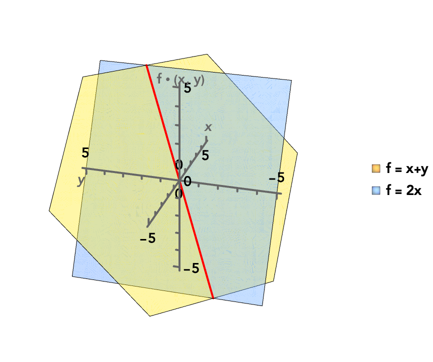
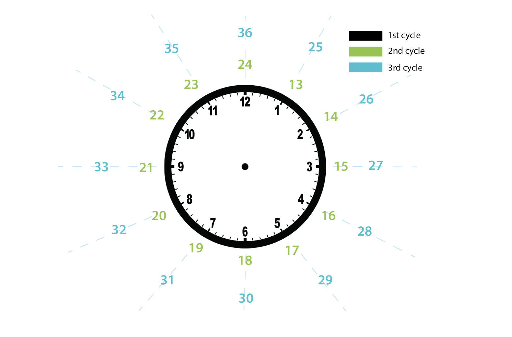
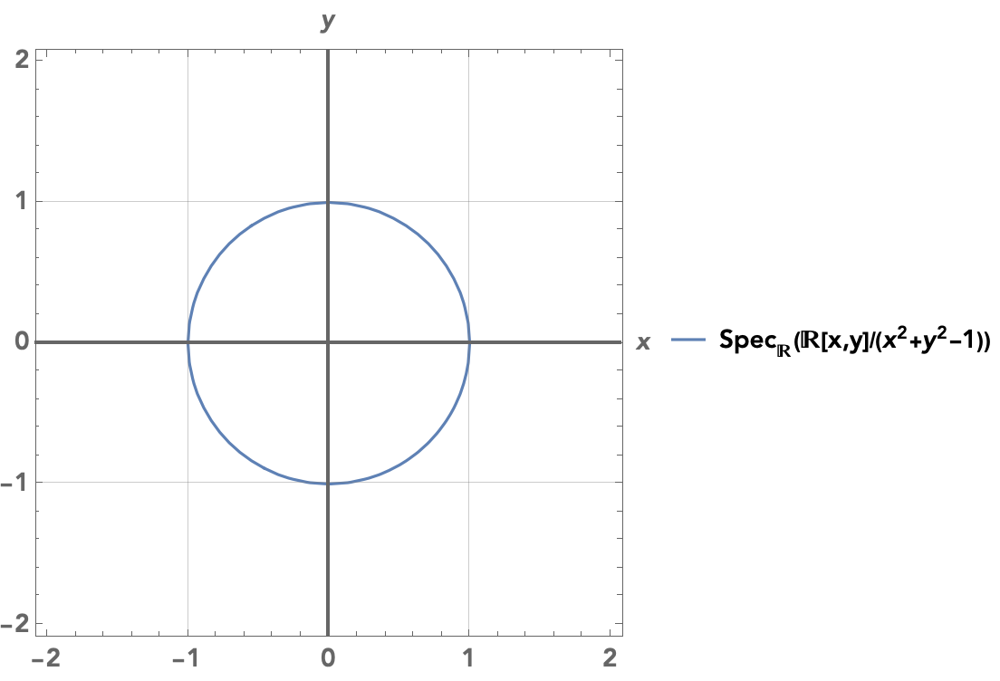
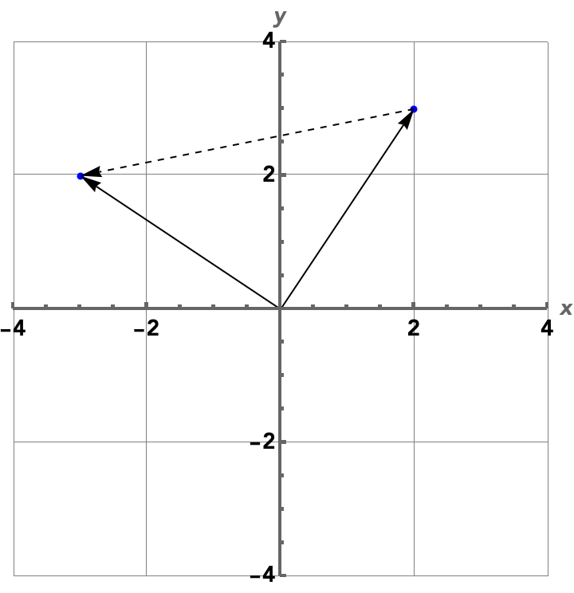
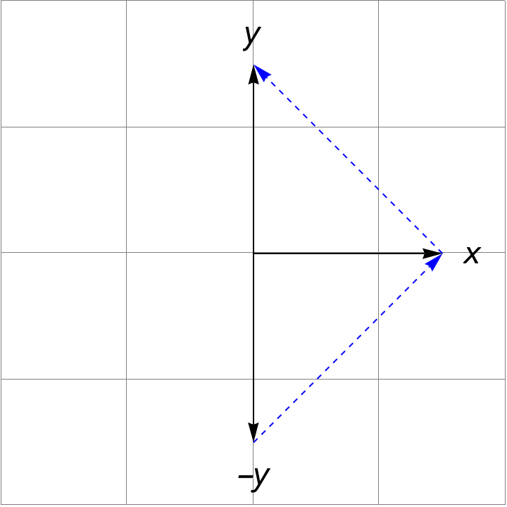
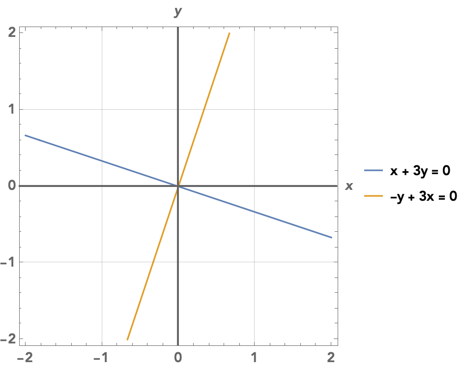

---
title: Understanding exact sequences (part 1)
published: true
---

$\newcommand{\ev}{\mathrm{ev}}$$\newcommand{\Spec}{\mathrm{Spec}}$
Is linear algebra about pointy little arrows? Random boxes of numbers that resemble more of the spreadsheets in accounting class than math? I want to show a more visible perspective to linear algebra.

We all know that algebra and geometry have a sort of kinship with each other. But other than fancy visualizations on YouTube that help you grok your professor's terrible explanations, what does that kinship entail?

Let's talk about a field related to linear algebra: algebraic geometry. In algebraic geometry, we study spaces that are defined by roots of polynomials. Polynomials are easy to define and work with, and there's a reason why mathematicians started with spaces defined by those polynomials. The ancient Greeks studied conic sections which can be defined as roots of polynomials, and even though they didn't have the algebra to appreciate it, there's a reason why conic sections were the first things mathematicians ever studied.

### Lines, lines everywhere

Let's consider spaces defined by these polynomials on the plane $\mathbb{R}^2$. A line $L$ with unit slope passing through the origin on the plane has the roots of the polynomial $x - y = 0$ as points.

There is another way to describe a point of the plane which we'll find useful here. Let $\mathbb{R}[x, y]$ be the set of all polynomials in two variables $x, y$ with real coefficients. Then a point $(a, b) \in \mathbb{R}^2$ (to not confuse it with the variables of the polynomial) could also be described as the function $p: \mathbb{R}[x, y] \to \mathbb{R}$ defined as

$$
p(k) = k ~[\text{for}~k \in \mathbb{R}], p(x) = a, p(y) = b
$$

Wait a minute! We've only defined $p$ on three different polynomials! Isn't it barely a function? Luckily, we can easily extend $p$ to a function for all polynomials in a natural way. Consider that we can add and multiply polynomials just like we can add or multiply real numbers. Every term of a polynomial in $\mathbb{R}[x, y]$ can be expressed as a product $kx^my^n$ for some real number $k$ and integers $m, n \geq 0$. So we can simply evaluate $p$ on each factor separately:

$$
p(kx^my^n) = p(k)p(x)^mp(y)^n
$$

Then we can take its product in $\mathbb{R}$ to get our answer. And given a sum of such terms $\sum_{i} k_ix^{m_i}y^{n_i}$, we can evaluate $p$ on each term separately then add:

$$
p\left(\sum_{i} k_ix^{m_i}y^{n_i}\right) = \sum_{i} p(k_ix^{m_i}y^{n_i})
$$

For example, the point $(2, 6)$ is represented by the function $p(x) = 2, p(y) = 6$. It is easy to evaluate a more intricate polynomial like, say, $3x + 5y$:

$$
p(3x + 5y) = 3p(x) + 5p(y) = 3(2) + 5(6) = 36
$$ 

Huh, it looks like $p$ just evaluated the polynomial $3x + 5y$ at the point $(2, 6)$. But that is no coincidence. By defining $p$ this way, we make it simply evaluate a polynomial at our chosen point. In general, for a point $(a, b)$, we call that function $p$ its **evaluation map**.

And here, the evaluation maps are useful because they allow us to determine whether a point $(a, b)$ is on the line $L$. If $(a, b)$ has the evaluation map $p: \mathbb{R}[x, y] \to \mathbb{R}$, then $p$ has to send the polynomial $x - y$ to $0$ since

$$
p(x - y) = p(x) - p(y) = a - b = 0
$$

and by definition, the line consists of all points $a - b$ for which $a - b = 0$! Furthermore, any polynomial multiple of $x - y$ has to be sent to $0$, since  if $g$ is a polynomial, then

$$
p(g (x - y)) = p(f)\underbrace{p(x - y)}_{= \,0} = 0
$$

So to sum it all up, here's the key idea: let $S$ be a subset of $\mathbb{R}^2$ defined as the roots of a polynomial $f$. A point $(a, b) \in \mathbb{R}^2$ with evaluation map $p$ is contained in $S$ if and only if $p(gf) = 0$ for all polynomial multiples $gf$ of $f$. For a polynomial $f$, we call the set $(f)$ of all of its multiples its **ideal**:

$$
(f) = \{gf \mid g \in \mathbb{R}[x, y] \}
$$

Given an evaluation map $p$, we can also get our original point back: it's simply $(p(x), p(y))$! So we can use evaluation maps instead of Cartesian coordinates, knowing that when we want those coordinates, we simply evaluate $p$ at our key points.

> This is similar to continuation-passing style: values are not just values, but instead functions that allow us to evaluate an arbitrary function (of the correct type) at that value. In this case, we can think of $p$ as the "continuation", taking a polynomial function and then plugging in the point $(a, b)$.

To get used to seeing points by their evaluation maps, we will introduce some new notation. We will let $\ev_{(a, b)}: \mathbb{R}[x, y] \to \mathbb{R}$ be precisely the evaluation map representing the point $(a, b)$. But we will also denote evaluating the polynomial $f$ on a point $a, b$ as

$$
f \cdot (a, b)
$$

Usually, we omit the dot, and here it looks like we're "multiplying" a polynomial by a point – a bit odd, right? But I wanted to emphasize that a polynomial is not *just* a function, it is an entity in its own right that we can add and multiply just like a number. A polynomial $f$ can *act* on a specific point $(a, b)$ by evaluating itself at the point, but hey, sometimes we just want to appreciate the polynomials themselves.

**Pause and ponder.** Can we extend this idea to $n$-dimensional spaces $\mathbb{R}^n$ in general outside of just $\mathbb{R}^2$?

### You get a function, they get a function, everyone gets a function! 

Consider the set of all evaluation maps $\mathbb{R}[x, y] \to \mathbb{R}$. It contains the evaluation map $\ev_{(a,b)}$ for any point $(a, b) \in \mathbb{R}^2$. But is it possible to restrict the set of polynomials $\mathbb{R}[x, y]$ so that it contains only the evaluation maps of points in a subspace, like our line $L$?

It turns out, as long as we can define the subspace as the roots of polynomials, it's quite easy.

Let $(a, b)$ be a point of the line $L$, which consists precisely of the roots of the polynomial $x - y$, so we have $(x - y) \cdot (a,b) = 0$. Furthermore, evaluating any polynomial multiple of $x - y$ on the point $(a, b)$ must result in $0$, so we have $g(x - y) \cdot (a, b) = 0$ for all polynomials $g \in \mathbb{R}[x,y]$. You can see from the image that the polynomials $0, x - y, 3(x - y)$ all take different values on the plane, but on the line $L$ (in red), they have the same value of $0$.

It's more interesting to consider polynomials that are *not* multiples of $x - y$. Consider the polynomial $x + y$. Of course, it doesn't evaluate to $0$ on the line outside of $(0, 0)$ – for example, $(x + y) \cdot (1, 1) = 2$. But on the other hand, if we add any multiple of $x - y$ to $f$, so we get

$$
(x + y) + g(x - y)
$$

for some polynomial $g$, then the result is still the same! The first polynomial $x - y$ evaluates to some value, but the second term evaluates to $0$ on the line, so it does nothing to the result. 

For example, $2x = (x + y) + (x - y)$ is a different polynomial to our eyes, but the same polynomial to the eyes of the line $L$. As you can see, both polynomials generally evaluate to different values over the entire plane, but on the diagonal spanned by $L$, they take on the exact same value.

--- 

So let's play a game here. Take the set $\mathbb{R}[x, y]$. Imagine if we can *force* any two polynomials that only differ by a multiple of $x - y$ to be the exact same. For example, in this new world, we could say that $2x = x + y$. And I know it seems ridiculous, but your imagination here is the reality that the line $L$ faces day to day.

Of course, if we want to realize this imaginary world, this means that we get an entirely new set where elements are instead *families* of polynomials, and we will call this set $\mathbb{R}[x, y]/(x - y)$.

We will denote the family of a given polynomial $f \in \mathbb{R}[x, y]$ as an element $[f] \in \mathbb{R}[x, y]/(x - y)$. So now, while $2x \neq x + y$ in $\mathbb{R}[x, y]$ itself (phew), their classes in $\mathbb{R}[x, y]/(x - y)$ are equal: $[2x] = [x + y]$.

> 
> You can see a miniature version of this idea in the integers modulo $n$. When working modulo $n$, you essentially pretend that any integers that differ by a multiple of $n$ are equal. So for example, modulo $12$ (a clock!), we know $7 + 8 \equiv 3$, because
> 
> $$
\begin{align}
7 + 8 &\equiv -5 + 8 \pmod{12} \\
&\quad [\text{as } 7 - (-5) = 12]\\
&\equiv 3 \pmod{12}
\end{align}
$$

To prevent confusion, when we say that two polynomials $f_1, f_2$ only differ by a multiple of $h$, we will write it as $f_1 \equiv f_2 \pmod{h}$.

Now, instead of considering evaluation maps $\mathbb{R}[x, y] \to \mathbb{R}$ for all polynomials, let's consider evaluation maps $\mathbb{R}[x, y]/(x - y) \to \mathbb{R}$ for our *classes* of polynomials. Outside of the line $L$, this wouldn't even make sense. We have $2x \equiv x + y \pmod{x - y}$, but we know those polynomials might evaluate to different values. For example, $(2, 3)$ is not on the line $L$, but

$$
2x \cdot (2, 3) = 4, (x + y) \cdot (2, 3) = 5
$$

In fact, $2x$ and $x + y$ evaluate to the same value *precisely* when the point $(a, b)$ is on the line $L$, since if we want the difference between the two evaluations to be zero,

$$
(2x - (x + y)) \cdot (a, b) = (x - y) \cdot (a, b) = 0
$$

it means that $(a, b)$ has to be a root of $x - y$, as we can see from the equation. So evaluation of a polynomial class in $\mathbb{R}[x, y]/(x - y)$ only makes sense on the line $L$, and the only valid evaluation maps from $\mathbb{R}[x, y]/(x - y)$ are those for points on the line $L$.

Here's another way to see it. When we defined evaluation maps originally, we didn't say "evaluation map" immediately, but simply defined a map $p$ on the polynomials $x, y$, and extended it to the entire set of polynomials by requiring that it works well with addition and multiplication. Let's take the point $(2, 3)$ again, and let $p: \mathbb{R}[x, y]/(x - y) \to \mathbb{R}$ be defined as $p(x) = 2, p(y) = 3$. We can immediately see the problem:

$$
p(x - y + 1) = p(1) = 1
$$

since $x - y + 1 \equiv 1 \pmod{x - y}$, but $x - y + 1$ evaluates to $4$ on $(2, 3)$.

--- 

Let's go over the ideas we covered so far. First, points on the plane $\mathbb{R}^2$ are not only uniquely determined by their coordinates $(a, b)$, but by how they evaluate polynomials of two variables through their evaluation map $\ev_{(a, b)}$. So we could define $\mathbb{R}^2$ as either the boring ol' pairs of real numbers, or

$$
\mathbb{R}^2 = \{ \text{all evaluation maps } \mathbb{R}[x, y] \to \mathbb{R} \}
$$

> "Tell me who your friends are, and I will tell you who you are." – $\mathbb{R}[x, y]$.

Second, if we have some subspace $S$ defined as the roots of a polynomial $f$, we can take its set of polynomial classes $\mathbb{R}[x, y]/(f)$ where each class consists of polynomials that only differ by a polynomial multiple of $f$. Then, there's no need to perform a penance when we define:

$$
S = \{ \text{all evaluation maps } \mathbb{R}[x, y]/(f) \to \mathbb{R} \}
$$

So in general, we can define a space $S$ **not as a space of points, but as a space of functions**. This is not only useful since functions have richer properties than mere points, but in practice, this has been the approach for much of modern math: study maps between things, not the things themselves.

--- 
 
We call the set of all evaluation maps from a set of polynomials $P$ onto the result of the evaluation in some set $k$, the **spectrum** $\Spec_k(P)$:

$$
\Spec_k(P) = \{ \text{all evaluation maps } P \to k \}
$$

We've only worked with $k = \mathbb{R}$ so far, but this will prove in handy if we work with complex numbers $k = \mathbb{C}$ instead or some other space. Furthermore, we've only worked with lines, but we can work with polynomials with any degree, like that of the unit circle $x^2 + y^2 - 1$. Since this post is about linear algebra though, we won't focus on those polynomials.

Now we can write

$$
\begin{align}
\mathbb{R}^2 &= \Spec_{\mathbb{R}}(\mathbb{R}[x, y]) \\
S &= \Spec_{\mathbb{R}}(\mathbb{R}[x, y]/(f))
\end{align}
$$

It is important to note that the spectrum $\Spec_k(P)$ is an actual space itself where the points are by themselves functions, but $P$ is simply the polynomials we can evaluate on the space. We will denote by $\mathcal{O}$ the operation that gets us those polynomials: $\mathcal{O}(\Spec_{k}(P)) := P$.

### Terraforming

Of course, given a space, we often want to transform it in some way. For example, we can rotate, reflect, expand, and shrink it. Let's take $\mathbb{R}^2$ again, which remember, we want to look at as a space of evaluation maps $\Spec_{\mathbb{R}}(\mathbb{R}[x, y])$. We want to represent transformations of the space $\mathbb{R}^2 \to \mathbb{R}^2$, but not as maps between points of coordinates, but maps between their evaluation functions. How do we do that under this framework?

Consider that changing a point $(a, b)$ in a space of coordinates, is the same as changing how polynomials are evaluated under $\ev_{(a, b)}$: how the point *sees* each polynomial. 

Our strategy here is to take an evaluation map $\ev_{(a, b)}: \mathbb{R}[x, y] \to \mathbb{R}$, and a transformation map $\varphi: \mathbb{R}[x, y] \to \mathbb{R}[x, y]$. Then we change how $\ev_{(a, b)}$ sees the polynomials by composing the two functions together, which gives us a new function $\ev_{(a, b)} \circ \varphi: \mathbb{R}[x, y] \to \mathbb{R}[x, y]$. It's like putting on a VR headset onto the point: its eyes are still the same – just like how a point is still a point no matter where it is – but it puts it into a new reality:

$$
\color{blue}{\mathbb{R}[x, y] \overset{\varphi}{\to}} \mathbb{R}[x, y] \overset{\ev_{(a, b)}}{\to} \mathbb{R}
$$

However, how do we make sure that $\ev_{(a, b)} \circ \varphi$ is still a valid evaluation map – that it is still a point in $\Spec_{\mathbb{R}}(\mathbb{R}[x, y])$? The answer is simple: make sure that it sends $1$ to $1$, and that it plays well with addition and multiplication. 

Given polynomials $f, g$, it should hold that $\varphi(1) = 1$, the sum $\varphi(f + g) = \varphi(f) + \varphi(g)$ and the product $\varphi(fg) = \varphi(f)\varphi(g)$. These are the same rules we required for evaluation maps, and this also means such a map $\varphi$ is completely determined by its value on the polynomials $x, y$.

Then the composite $\ev_{(a, b)} \circ \varphi$ is also an evaluation map, but an evaluation map for what point? Simple: it is the evaluation map for the point 
$(\ev_{(a, b)}(\varphi(x)), \ev_{(a,b)}(\varphi(y)))$! 

So in general, given a map $\varphi: P \to Q$ between two sets of polynomials $P$ and $Q$ that meets the rules we've talked about, we get a map $\varphi^*: \Spec_k(Q) \to \Spec_k(P)$ that takes an evaluation map $p: Q \to k$ and sends it to the evaluation map $p \circ \varphi: P \to k$:

$$
\begin{align}
\color{blue}{P \overset{\varphi}{\to}} &Q \overset{p}{\to} k \\
\varphi^*(p) &= p \circ \varphi
\end{align}
$$

All of this is pretty abstract stuff, so let's go over an example.

---

Let $\varphi: \mathbb{R}[x, y] \to \mathbb{R}[x, y]$ be the map

$$
\varphi(x) = -y, \varphi(y) = x
$$

Now, consider the point $(2, 3)$. It is defined by the evaluation map $\ev_{(2, 3)}(x) = 2, \ev_{(2, 3)}(y) = 3$. Then if we apply $\varphi$ to the evaluation maps like we described above, we get

$$
\begin{align}
\ev_{(2, 3)}(\varphi(x)) &= \ev_{(2, 3)}(-y) = -3\\
\ev_{(2, 3)}(\varphi(y)) &= \ev_{(2, 3)}(x) = 2
\end{align}
$$

So the map $(2, 3)$ gets transformed to $(-3, 2)$. And it is no coincidence that this is simply a clockwise rotation by a right angle, since it simply maps the point $(a, b)$ to $(-b, a)$.

Let's see what we've done here though. Say you have a polynomial $f$ – let's use $x + 3y$. We want to evaluate this polynomial on a point on the plane. Normally, we could just use its evaluation map $p$ and we have our answer. But say that the point is lying to us: it's been rotated by a right angle clockwise.

However, because a rotation is a particularly nice transformation (and not some weird encryption scheme), we can simply change our polynomial $x + 3y$ to take into account that transformation. Now, the $-y$-axis has been moved to the $x$ axis, and the $x$ axis has been moved to the $y$ axis. So we simply change all instances of $x$ to $-y$, and all instances of $y$ to $x$ to get the polynomial $-y + 3x$. Then we can evaluate $x + 3y$ on the point like nothing ever happened by first using $\varphi$ on the polynomial to take into account the rotation, then simply apply $\varphi(x + 3y)$ to our point, allowing us to pretend nothing ever happened.

Finally, $x + 3y$ and $-y + 3x$ are not just polynomials, but they also define a *subspace* of $\mathbb{R}^2$ – simply consider all of its roots, which form the subspaces $\Spec_{\mathbb{R}}(\mathbb{R}[x, y]/(x+3y))$ and $\Spec_{\mathbb{R}}(\mathbb{R}[x, y]/(-y + 3x))$. It is no coincidence that these two subspaces are simply rotated versions of each other.

In general, a clockwise rotation by $\theta$ radians is represented by the map

$$
\begin{align}
\varphi(x) &= \cos(\theta) x - \sin(\theta) y \\
\varphi(y) &= -\sin(\theta) x + \cos(\theta) y
\end{align} 
$$

