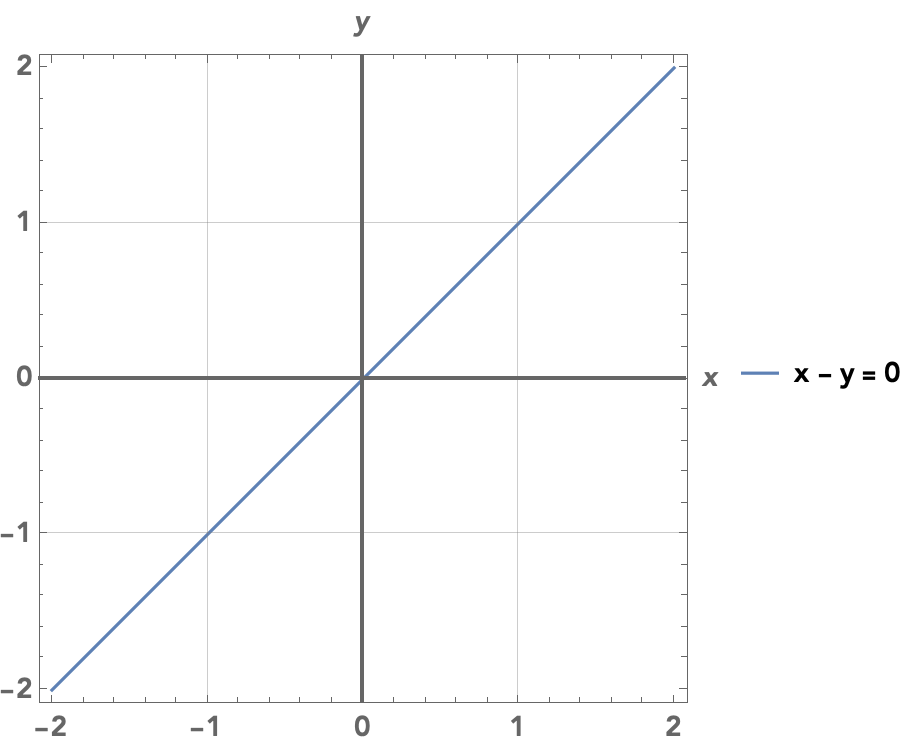
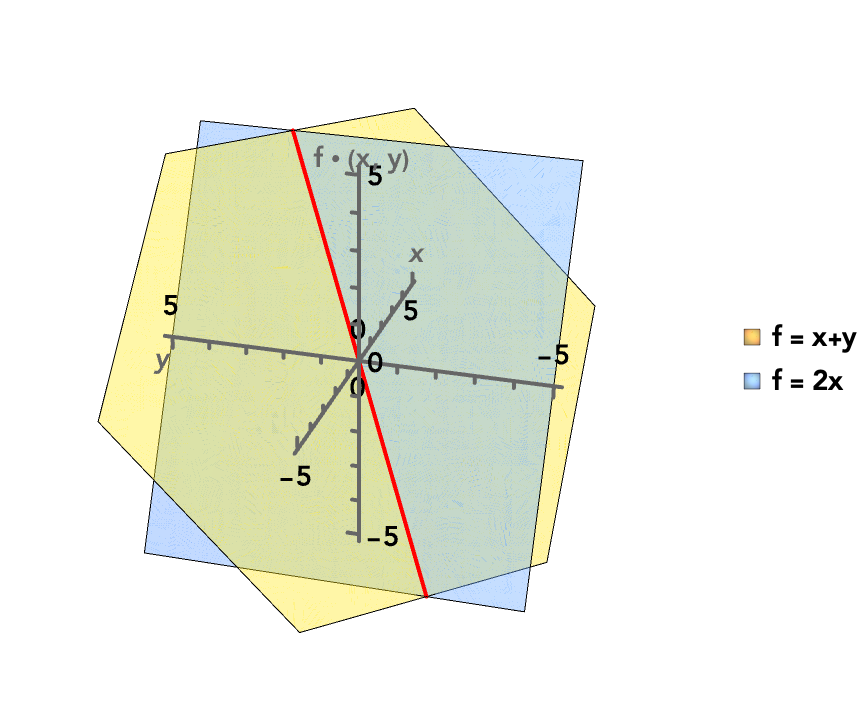
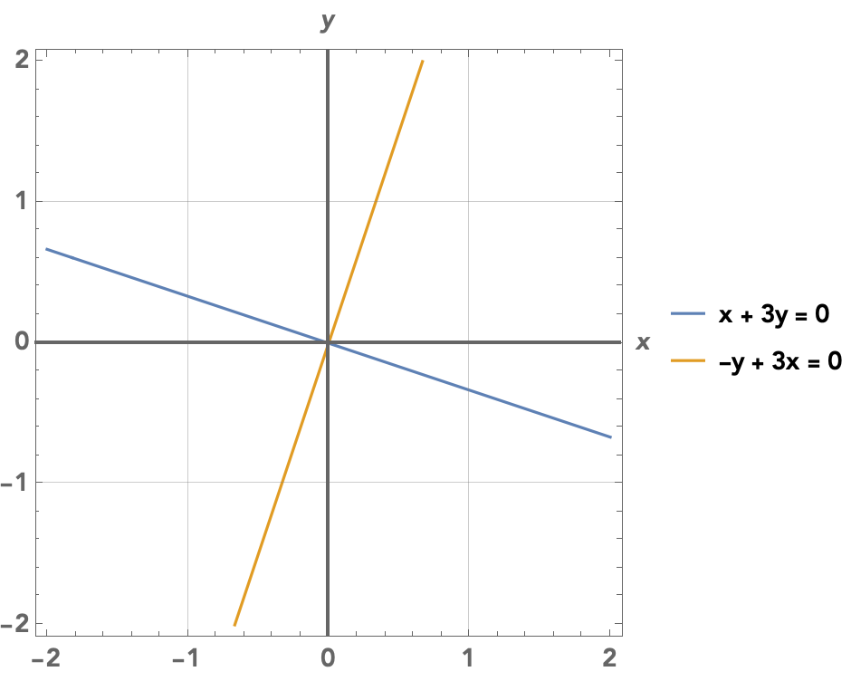

$\newcommand{\ev}{\mathrm{ev}}$$\newcommand{\Spec}{\mathrm{Spec}}$Is linear algebra about pointy little arrows? Random boxes of numbers that resemble more of the spreadsheets in accounting class than math? I want to show a more visible perspective to linear algebra.

We all know that algebra and geometry have a sort of kinship with each other. But other than fancy visualizations on YouTube that help you grok your professor's terrible explanations, what does that kinship entail?

Let's talk about a field related to linear algebra: algebraic geometry. In algebraic geometry, we study spaces that are defined by roots of polynomials, as polynomials are easy to define and work with. Linear algebra studies the even nicer case where these spaces contain the origin point $0$, and the polynomials are linear polynomials which have degree $1$.

### It starts with lines

Let's consider spaces defined by these polynomials on the plane $\mathbb{R}^2$. A line $L$ with slope $1$ passing through the origin $(0, 0)$ on the plane has the roots of the polynomial $x - y$ as points.

We could describe the points of $L$ by their coordinates $(a, b)$, but there's another interesting way to describe a point of the plane which we'll find useful here. 

Let $\mathbb{R}[x, y]$ be the set of all polynomials in two variables $x, y$ with real coefficients. This set includes polynomials like $x - y$, $x^2 + x$, $y^3 + 3x$, and $2xy^2 + 3xy$.

Then a point associated to the coordinate $(a, b)$ (to not confuse it with the variables of the polynomial) could *also* be described as the function $p: \mathbb{R}[x, y] \to \mathbb{R}$ defined as

$$
p(k) = k ~[\text{for}~k \in \mathbb{R}], p(x) = a, p(y) = b
$$

Wait a minute! We've only defined $p$ on constants as well as the polynomials $x$ and $y$! Isn't it barely a function? Furthermore, why are we passing *polynomials* to a function, when they're usually the functions themselves?

#### Polynomials have feelings too

Back in school, we treated polynomials as mere functions. A polynomial is nothing more than something we can plug in values to. But in the eyes of our function $p$, polynomials *are* the values themselves. And they're just like numbers in many ways.

Consider that we can add and multiply polynomials just like we can add or multiply numbers. They follow essentially all the laws that we're used to when we work with integers. For example, polynomials also follow the distributive law:

$$
3x(x^2 + 4) = 3x(x^2) + 3x(4) = 3x^3 + 12x
$$

But just like integers, we cannot divide by a nonzero polynomial and always get a polynomial in return. That is because division by a polynomial $g$ is the same as multiplying by $1/g$, but $1/g$ is not a polynomial unless $g$ is a nonzero constant.

We want to work with the polynomials themselves, treating them like a value instead of relegating them to the life of a function, as **polynomials can describe spaces that aren't just points.** We work with coordinates, which are just bundles of numbers, to describe points in space. We often describe transformations on single points using the convenient fact that those points are represented by numbers. For example, the map

$$
(x, y) \mapsto (x+1, y)
$$

translates a point $1$ unit to the right, but realize we've just described a movement in space with only addition! The whole premise of algebraic geometry is that:

- Instead of only caring about single points, polynomials are now the main currency, which describe entire spaces.
- We can often describe transformations of points using simple operations that only involve numbers. Building on this idea, as polynomials behave like numbers in a lot of ways, we can describe transformations of these spaces using polynomials as well!

#### Varieties: where polynomials are the points

In general, a space that is defined by the roots of a system of polynomials is called a **variety**. 

> Now, we have to be careful here, since there are a lot of definitions of "variety", some more general than others. All of these definitions are special cases of a **scheme**, which is way beyond the topic of this post. However, we will be fast and loose here, and simply refer to any space that we've used polynomials to define as a variety.

However, notice that any root of a given polynomial is also a root for an *multiple* of that polynomial – and that multiple can itself be a polynomial. For example, $3$ is a root of $x^2 - 9$, and it is also a root of $(x^5 + 3x^4 + 4x^3 + 2x^2 + 1)(x^2 - 9)$. You don't even have to compute the grotesque polynomial factor we added. Simply knowing $3^2 - 9 = 0$ means the entire product is $0$. For a polynomial $f$, we call the set $(f)$ of all of its multiples its **ideal**:

$$
(f) = \{gf \mid g \in \mathbb{R}[x, y] \}
$$

and for a system of polynomials $(f_1, \dots, f_n)$ so that a point has to be the roots of every polynomial in the list, it also has an ideal

$$
(f_1, \dots, f_n) = \{g_1f_1 + \dots + g_nf_n \mid g_1, \dots, g_n \in \mathbb{R}[x, y] \}
$$

as if a point is the root of *every* polynomial in $f_1, \dots, f_n$, then evaluating any polynomial $g_1f_1 + \dots + g_nf_n$ at that point would yield $0$ since every term would evaluate to $0$. So in our case, every *ideal* $(f_1, \dots, f_n)$ defines a variety, which we denote as

$$
V(f_1, \dots, f_n) = \{ \text{points that are roots of every polynomial in } f_1, \dots, f_n \}
$$

By considering ideals instead of just raw polynomials, we're just ensuring that any polynomials that we know are guaranteed to evaluate to $0$ don't feel left out! So for example, $L$ is the variety $V(x - y)$, but it could also be the variety $V(g(x - y))$ for any nonzero polynomial $g$. Yet, the ideals $(x - y)$ and $g(x - y)$ are the same. 

We can think of a variety as a **very large point**. Sounds silly, given that varieties themselves consist of points. But consider what we can do on points: we can transform them with simple operations like addition and multiplication. We can also transform varieties using the same operations by transforming their defining polynomials.

For example, if we wanted to do the same translation we did to the point – shifting right by $1$ unit – to the line $L = V(x - y)$, we simply replace $x$ in the polynomial $x - y$ with $x - 1$. Then as you can see, the new variety  $V((x - 1) + y)$ is just $L$ shifted $1$ unit to the right.

So we can see how a map of varieties could be a map of polynomials: we have a function $\varphi: \mathbb{R}[x, y] \to \mathbb{R}[x, y]$ – which takes polynomials to polynomials – substituting all instances of $x$ for $x - 1$, and leaving everything else as is. Then we simply apply $\varphi$ to the polynomial $x - y$ defining the line $L$ to get $(x - 1) + y$.

#### Back on topic

Remember that we wanted to represent points on the plane as functions, where a point $(a, b)$ is defined by the function $p: \mathbb{R}[x, y] \to \mathbb{R}$ that sends:

$$
p(k) = k ~[\text{for}~k \in \mathbb{R}], p(x) = a, p(y) = b
$$

But the issue was that we've only defined it on constants and the two polynomials $x$ and $y$, and there are certainly way more than those polynomials! Well, let's consider what we want our function $p$ to even do.

The point $(a, b)$ can be a point in many different varieties. For example, the point $(0, 0)$ is a point of *any* variety whose polynomials have no constant terms, as it is always root of those polynomials. But it is also *not* a point in many different varieties. In this case, any polynomial with a constant term is no longer fair game. 

So we want $p$ to do this:

- Given a polynomial $f$, determine whether $(a, b)$ is a point of the variety $V(f)$. If it is, $p(f)$ should be $0$. 
- Otherwise, determine how far away it is from being such a point.

How do we define $p$ to do that? Simple: simply let $p$ **evaluate** a given polynomial at the point $(a, b)$. If $p(f) = 0$, then $(a, b)$ is a point of the variety $V(f)$. Otherwise, if $p(f) = c$ for some nonzero constant $c$, then it is $c$ units away from being a point of a variety $V(f)$. We can change the variety to be $V(f + c)$, then $(a, b)$ is yet again a point of the variety.

We first define

$$
p(k) = k ~[\text{for}~k \in \mathbb{R}], p(x) = a, p(y) = b
$$

which makes sense once you know $p$ evaluates the respective polynomials at $(a, b)$. To evaluate a sum of polynomials $f + g$, we just evaluate each term:

$$
p(f + g) = p(f) + p(g)
$$

And to evaluate a product of polynomials $fg$, we just evaluate each factor:

$$
p(fg) = p(f)p(g)
$$

By imposing these two common-sense rules, we've just extended $p$ to evaluate *any* polynomial! For example, the point $(2, 6)$ is represented by the function $p(x) = 2, p(y) = 6$. It is easy to evaluate a more intricate polynomial like, say, $3x + 5y$:

$$
p(3x + 5y) = 3p(x) + 5p(y) = 3(2) + 5(6) = 36
$$ 

In general, for a point $(a, b)$, we call the function $p$ that evaluates a polynomial its **evaluation map**.

Back to the example of $(0, 0)$, given a polynomial $f$, the evaluation map $p$ sends $p(x) = 0, p(y) = 0$. So what are we left with? The constant term that are preventing $(0, 0)$ from being a point of the variety $V(f)$:

$$
p(3x + 4y + 2) = 3p(x) + 4p(y) + 2 = 3(0) + 3(0) + 2 = 2
$$

---

So to sum it all up, here's the key idea: let $V(f)$ be a variety. A point $(a, b)$ with evaluation map $p$ is contained in the variety $V(f)$ if and only if $p(f) = 0$.

This automatically means that any multiple of $f$ – any polynomial in the variety $(f)$ – is contained in $V(f)$ since $p(gf) = gp(f) = g(0) = 0$. It is not too hard to see this also applies to varieties $V(f_1, \dots, f_n)$ of multiple polynomials.

Given an evaluation map $p$, we can also get our original point back: it's simply $(p(x), p(y))$! So we can use evaluation maps instead of Cartesian coordinates, knowing that when we want those coordinates, we simply evaluate $p$ at our key points.

> This is similar to continuation-passing style: values are not just values, but instead functions that allow us to evaluate an arbitrary function (of the correct type) at that value. In this case, we can think of $p$ as the "continuation", taking a polynomial function and then plugging in the point $(a, b)$.

To get used to seeing points by their evaluation maps, we will introduce some new notation. We will let $\ev_{(a, b)}: \mathbb{R}[x, y] \to \mathbb{R}$ be precisely the evaluation map representing the point $(a, b)$. But we will also denote evaluating the polynomial $f$ on a point $a, b$ as

$$
f \cdot (a, b)
$$

Usually, we omit the dot, and here it looks like we're "multiplying" a polynomial by a point – a bit odd, right? But I wanted to emphasize that a polynomial is not *just* a function, it is an entity in its own right that we can add and multiply just like a number. A polynomial $f$ can *act* on a specific point $(a, b)$ by evaluating itself at the point, but hey, sometimes we just want to appreciate the polynomials themselves.

**Food for thought.** Can we extend this idea to $n$-dimensional spaces $\mathbb{R}^n$ in general outside of just $\mathbb{R}^2$?

### Corporate needs you to find the differences...

Let $(a, b)$ be a point of the line $L$. As we discussed, evaluating any multiple of $x - y$ on the point $(a, b)$ must also result in $0$. You can see from the image that the polynomials $0, x - y, 3(x - y)$ all take different values on the plane, but on the line $L$ (in red), they have the same value of $0$. Or in other words, any polynomial in the ideal $(x - y)$ evaluates to $0$ on $L$.

It's more interesting to consider polynomials that are *not* multiples of $x - y$. Consider the polynomial $x + y$. Of course, it doesn't evaluate to $0$ on the line outside of $(0, 0)$. For example, we have $(x + y) \cdot (1, 1) = 2$. But on the other hand, if we add any multiple of $x - y$ to $x + y$, so we get

$$
(x + y) + g(x - y)
$$

for some polynomial $g$, then the result of evaluating it on *any* point on the line remain the same! The first term $x + y$ evaluates to some value, but the second term evaluates to $0$ on the line by definition, so it does nothing to the result. 

For example, $2x = (x + y) + (x - y)$ is a different polynomial to our eyes, but the same polynomial function on the line $L$. As you can see, both polynomials generally evaluate to different values over the entire plane, but on the diagonal spanned by $L$, they take on the exact same value.

In general, for polynomials $g, h$...

- whose difference $g - h$ is in the ideal $(f_1, \dots, f_n)$,
- by definition $g - h$ evaluates to $0$ on the variety $V(f_1, \dots, f_n)$,
- so $g$ and $h$ are the same polynomial function on $V(f_1, \dots, f_n)$!

It is important to note that it is possible for $g - h$ to *not* be in the ideal $(f_1, \dots, f_n)$, yet still have $g$ and $h$ define the same function on the variety $V(f_1, \dots, f_n)$. That's because the polynomials in $(f_1, \dots, f_n)$ are not necessarily the only polynomials that evaluate to $0$ on $V(f_1, \dots, f_n)$.  So having $g - h$ be in $(f_1, \dots, f_n)$ is enough, but not necessary, for $g$ and $h$ to be the same function on $V(f_1, \dots, f_n)$. 

---

In algebraic geometry, we want to relate the algebra and geometry together as the name suggests. Every variety $V(f_1, \dots, f_n)$ can be assigned a set of polynomial functions. As much as possible though, we want to identify polynomials that define the same function on the variety.

One of the most important concepts in all of math is the integers modulo $12$, because they allow us to reason with clocks correctly! Unless you're a time traveller, you'll never experience the exact same hour ever again, but that doesn't mean it isn't useful to identify the time of day. A clock does so by forcing any two unique hours that are a multiple of $12$ hours apart to be the same hour. For example, we know 8 hours after 7AM is 3PM since

$$
\begin{align}
7 + 8 &\equiv -5 + 8 \pmod{12} \\
&\quad [\text{as } 7 - (-5) = 12]\\
&\equiv 3 \pmod{12}
\end{align}
$$

And the reason is simple: it's often less useful to know that the current time is 13.8 plus something billion years, than it is to know the time of day. To astronomers and physicists, the former might be very meaningful, but to the layperson, just tell them it's 3PM!

Using the line $L$ again, every polynomial $f$ in $\mathbb{R}[x, y]$ defines the same function on $L$ as the polynomial $f + h(x - y)$ over all polynomials $h$. We can group up all these polynomials into a single **class** $[f]$. We can take any function in the class to represent the entire class.

And given another class $[g]$, it turns out we can add and multiply these classes like we would with polynomials – regardless of what we choose to represent the classes:

$$
[f] + [g] = [f + g], [f][g] = [fg]
$$

So the set of polynomial functions on $L$ can defined as the set of all of these classes. What we are doing is essentially *forcing* any two polynomials that differ by a multiple of $x - y$ to be equal, since they both define the same function on $L$ itself. For example, we know that $2x - (x + y) = x - y$, so $[2x] = [x + y]$. We can also write $2x \equiv x + y \pmod{x - y}$, or if the context is clear, we could even write $2x = x + y$ (be careful though).

So for a variety $V(f_1, \dots, f_n)$ on the plane $\mathbb{R}^2$, we write the set of functions as $\mathbb{R}[x, y]/(f_1, \dots, f_n)$. Any polynomials $g, h$ whose difference $g - h$ is in $(f_1, \dots, f_n)$, and hence evaluate to $0$ on the variety by definition, are to be treated as the same. For example, we can write this set of functions on the line $L = V(x - y)$ as $\mathbb{R}[x, y]/(x - y)$. 

Now, consider that if an evaluation map $p: \mathbb{R}[x, y]/(f_1, \dots, f_n) \to \mathbb{R}$ exists, that implies that the corresponding point is in the variety $V(f_1, \dots, f_n)$. 

Why is that? For a point $(a, b)$, we have

$$
p(f_1) = \dots = p(f_n) = 0
$$

since $0 \in (f_1, \dots, f_n)$ (simply multiply any polynomial in the list by $0$), so we have $[f_1] = \dots = [f_n] = [0]$. If evaluating $f_1, \dots, f_n$ on $(a, b)$ results in $0$, then that means by definition that $(a, b)$ is in $V(f_1, \dots, f_n)$.

For points that are outside the variety, it is possible for two polynomials to be in the same class, but evaluate to different values on that point. For example, the polynomial $2x$ and $3x - y$ are in the same class within $\mathbb{R}[x, y]/(x - y)$, but on the point $(1, 2)$ which is outside the line, they evaluate to different values:

$$
2x \cdot (1, 2) = 2, (3x - y) \cdot (1, 2) = 1
$$

--- 

Let's go over the ideas we covered so far. First, points on the plane $\mathbb{R}^2$ are not only uniquely determined by their coordinates $(a, b)$, but by how they evaluate polynomials of two variables through their evaluation map $\ev_{(a, b)}$. So we could define $\mathbb{R}^2$ as either the boring ol' pairs of real numbers, or

$$
\mathbb{R}^2 = \{ \text{all evaluation maps } \mathbb{R}[x, y] \to \mathbb{R} \}
$$

> "Tell me who your friends are, and I will tell you who you are." – $\mathbb{R}[x, y]$.

Second, if we have a variety $V(f_1, \dots, f_n)$, we can take its set of polynomial classes $\mathbb{R}[x, y]/(f_1, \dots, f_n)$. Then, since an evaluation map from $\mathbb{R}[x, y]/(f)$ is only defined on points that are in the variety $V(f_1, \dots, f_n)$, it is possible to define $V(f_1, \dots, f_n)$ as the set of those evaluation maps:

$$
V(f_1, \dots, f_n) = \{ \text{all evaluation maps } \mathbb{R}[x, y]/(f_1, \dots, f_n) \to \mathbb{R} \}
$$

This is not only useful since functions have richer properties than mere points, but in practice, this has been the approach for much of modern math: study maps between things, not the things themselves.

Finally, even though we will only consider varieties over the plane $\mathbb{R}^2$ in this post, note that **the general idea applies to all dimensions** $\mathbb{R}, \mathbb{R}^2, \mathbb{R}^3, \dots$.

### Transforming space

Let $\varphi: \mathbb{R}[x, y] \to \mathbb{R}[x, y]$ be a map of *polynomials*, which we define on only two polynomials:

$$
\varphi(k) = k~[\text{for } k \in \mathbb{R}], \varphi(x) = -y, \varphi(y) = x
$$

We extend $\varphi$ to every polynomial in an identical fashion to how we extended evaluation maps:

$$
\varphi(f + g) = \varphi(f) + \varphi(g), \varphi(fg) = \varphi(f)\varphi(g)
$$

Now, consider the point $(2, 3)$. It is defined by the evaluation map $\ev_{(2, 3)}(x) = 2, \ev_{(2, 3)}(y) = 3$. What if we *compose* this evaluation map with $\varphi$ to get the map $\ev_{(2, 3)} \circ \varphi$?

$$
\begin{align}
\ev_{(2, 3)}(\varphi(x)) &= \ev_{(2, 3)}(-y) = -3\\
\ev_{(2, 3)}(\varphi(y)) &= \ev_{(2, 3)}(x) = 2
\end{align}
$$

It turns out the map $(2, 3)$ gets transformed to $(-3, 2)$. Indeed, $\ev_{(2, 3)} \circ \varphi$ is simply the evaluation map $\ev_{(3, 2)}$. And it is no coincidence that this is simply a clockwise rotation by a right angle, since it simply maps the point $(a, b)$ to $(-b, a)$. To get the first coordinate of the original point $(2, 3)$, we had to evaluate it on $x$ to get the value $2$. After transforming by $\varphi$, we have to evaluate it on $-y$, which turns out to be $-3$. Hopefully, you can see a similar thing for the second coordinate.

In general, given any map of polynomials that meets the rules we described, we can *apply* it to an evaluation map to get a new evaluation map:

$$
\color{blue}{\mathbb{R}[x, y] \overset{\varphi}{\to}} \mathbb{R}[x, y] \overset{\ev_{(a, b)}}{\to} \mathbb{R}
$$

So now the technology we use for points and transformations of those points are the same: they're just functions! 

Let's see what we've done here though. Say you have a polynomial – let's use $x + 3y$. We want to evaluate this polynomial on a point $(a, b)$ in the plane. Normally, we could just use its evaluation map $\ev_{(a, b)}$ and we have our answer. But say that the point is lying to us: it's been rotated by a right angle clockwise.

However, because a rotation is a particularly nice transformation (and not some weird encryption method), we can simply change our polynomial $x + 3y$ to take into account that transformation. Via $\varphi$, the $-y$-axis has been moved to the $x$ axis, and the $x$ axis has been moved to the $y$ axis. 

So we simply change all instances of $x$ to $-y$, and all instances of $y$ to $x$ to get the polynomial $-y + 3x$. Then we can evaluate $x + 3y$ on the point like nothing ever happened by first using $\varphi$ on the polynomial to take into account the rotation, then simply apply $\varphi(x + 3y) = -y + 3x$ to our point instead.

Of course, $x + 3y$ and $-y + 3x$ are not just polynomials, but they also define the varieties $V(x+3y)$ and $V(-y + 3x)$. These varieties are lines that cross the origin: you probably know that the equation of such a line is 

$$y = mx \Rightarrow mx - y = 0$$

In particular, the line $x + 3y$ actually has slope $\frac{1}{3}$, but we don't have to use the polynomial $\frac{1}{3}x - y$ to represent the variety $V(x + 3y)$, since $\frac{1}{3}x - y$ is in the same ideal as $x + 3y$.

It is no coincidence that these two subspaces are simply rotated versions of each other. When we compose $\varphi$ with an evaluation map for a point, we get the evaluation map for that same point rotated a right angle clockwise around the origin. When applied across the entire line, we get a rotated version of that line.

In general, if 

$$V(f_1, \dots, f_n) = \{ \text{all evaluation maps } \mathbb{R}[x, y]/(f_1, \dots, f_n) \to \mathbb{R} \}$$

#### Linear maps

We already mentioned that the map $\varphi$ we defined above simply rotates the axes. When we applied it to the entire *variety* $V(x + 3y)$, which is a line, all it does is rotate the line by a right angle to get us another line $V(-y + 3x)$ which still crosses the origin $(0, 0)$. It does not shift the line so that it knocks it off the origin, nor does it bend the line so that it is curved.

$\varphi$ is an example of a **linear map**, which can be described by a linear system of equations with no constant terms. In general, a linear map from the spaces $\mathbb{R}^m \to \mathbb{R}^n$ is given by a map of polynomials $\varphi: \mathbb{R}[y_1, \dots, y_n] \to \mathbb{R}[x_1, \dots, x_m]$, meeting the rules we described above, that can be defined as a linear system

$$
\begin{align}
\varphi(y_1) &= a_{1,1} x_1 + \dots + a_{1,m} x_m \\
\varphi(y_2) &= a_{2,1} x_1 + \dots + a_{2,m} x_m \\
&~\vdots \\
\varphi(y_n) &= a_{n,1} x_1 + \dots + a_{n,m} x_m \\
\end{align}
$$

which is represented by a **matrix**

$$
\begin{pmatrix}
a_{1, 1} & \dots & a_{1,m} \\
a_{2, 1} & \dots & a_{2,m} \\
\vdots & \ddots & \vdots  \\
a_{n, 1} & \dots & a_{n,m} 
\end{pmatrix}
$$

Linear maps have a special property: they transform lines that intersect the origin to either the origin $(0, 0)$ or another line that also intersects the origin. A linear map cannot bend the line nor translate the line.

For example, a clockwise rotation by $\theta$ radians is a linear map as it can be described by the linear system:

$$
\begin{align}
\varphi(x) &= x \cos(\theta) + y \sin(\theta)  \\
\varphi(y) &= - x \sin(\theta) + y \cos(\theta)
\end{align} 
$$

Say we are given a point $(a, b)$ that becomes the point $(a', b')$ after rotation by $\theta$ radians. Expressed in terms of points, a rotation by $\theta$ radians sends the point $(a, b)$ to

$$
(a \cos(\theta) + b \sin(\theta), - a \cos(\theta) + b \sin(\theta))
$$

To evaluate the polynomial $x$ on $(a', b')$ using $\ev_{(a, b)}$, which would give us the value $a'$, we have to take into account that the value $a$ is now $a' = a \cos(\theta) + b \sin(\theta)$. But if we use $\ev_{(a, b)} \circ \varphi$ to evaluate $x$ instead, we're all good:

$$
\ev_{(a, b)}(\varphi(x)) = \ev_{(a, b)}(x \cos(\theta) + y \sin(\theta)) = a \cos(\theta) + b \sin(\theta)  
$$

A rotation by $\theta$ radians has more familiar matrix representation

$$
\begin{pmatrix}
\cos(\theta) & \sin(\theta) \\
-\sin(\theta) & \cos(\theta)
\end{pmatrix}
$$

where the *rows* represents the coefficients of the polynomials $\varphi(x), \varphi(y)$.
