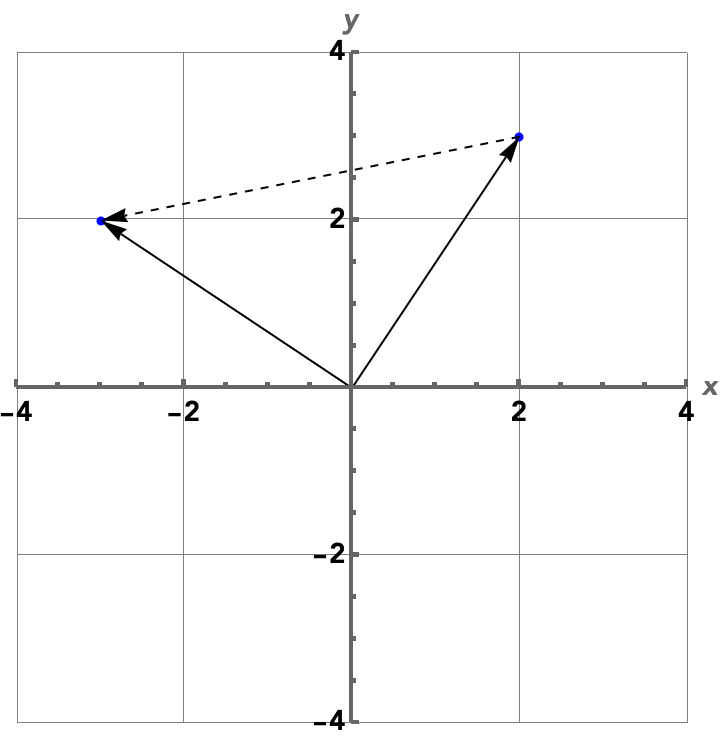

$\newcommand{\ev}{\mathrm{ev}}$$\newcommand{\Spec}{\mathrm{Spec}}$Is linear algebra about pointy little arrows? Random boxes of numbers that resemble more of the spreadsheets in accounting class than math? I want to show a more visible perspective to linear algebra.

We all know that algebra and geometry have a sort of kinship with each other. But other than fancy visualizations on YouTube that help you grok your professor's terrible explanations, what does that kinship entail?

Let's talk about a field related to linear algebra: algebraic geometry. In algebraic geometry, we study spaces that are defined by roots of polynomials, as polynomials are easy to define and work with. Linear algebra studies the even nicer case where these spaces contain the origin point $0$, and the polynomials are linear polynomials which have degree $1$.

### It starts with lines

Let's consider spaces defined by these polynomials on the plane $\mathbb{R}^2$. A line $L$ with slope $1$ passing through the origin $(0, 0)$ on the plane has the roots  of the polynomial $x - y$ as points.

There is another way to describe a point of the plane which we'll find useful here. Let $\mathbb{R}[x, y]$ be the set of all polynomials in two variables $x, y$ with real coefficients. Then a point $(a, b) \in \mathbb{R}^2$ (to not confuse it with the variables of the polynomial) could also be described as the function $p: \mathbb{R}[x, y] \to \mathbb{R}$ defined as

$$
p(k) = k ~[\text{for}~k \in \mathbb{R}], p(x) = a, p(y) = b
$$

Wait a minute! We've only defined $p$ on three different polynomials! Isn't it barely a function? Luckily, we can easily extend $p$ to a function for all polynomials in a natural way. Furthermore, why are we passing *polynomials* to a function, when they're usually the functions themselves?

#### Polynomials have feelings too

Back in school, we treated polynomials as mere functions. A polynomial is nothing more than something we can plug in values to. But in the eyes of our function $p$, polynomials *are* the values themselves. And they're just like numbers in many ways.

Consider that we can add and multiply polynomials just like we can add or multiply numbers. They follow essentially all the laws that we're used to when we work with integers. For example, polynomials also follow the distributive law:

$$
3x(x^2 + 4) = 3x(x^2) + 3x(4) = 3x^3 + 12x
$$

But just like integers, we cannot divide by a nonzero polynomial and always get a polynomial in return. That is because division by a polynomial $g$ is the same as multiplying by $1/g$, but $1/g$ is not a polynomial unless $g$ is a nonzero constant.

We want to work with the polynomials themselves, treating them like a value instead of relegating them to the life of a function, as **polynomials can describe spaces that aren't just points.** We work with coordinates, which are just bundles of numbers, to describe points in space. We often describe transformations on single points using the convenient fact that those points are represented by numbers. For example, the map

$$
(x, y) \mapsto (x+1, y)
$$

translates a point $1$ unit to the right, but realize we've just described a movement in space with only addition! The whole premise of algebraic geometry is that:

- Instead of only caring about single points, polynomials are now the main currency, which describe entire spaces.
- We can often describe transformations of points using simple operations that only involve numbers. Building on this idea, as polynomials behave like numbers in a lot of ways, we can describe transformations of these spaces using polynomials as well!

In general, a space that is defined by the roots of polynomials is called a **variety**. 

> Now, we have to be careful here, since there are a lot of definitions of "variety", some more general than others. All of these definitions are special cases of a **scheme**, which is way beyond the topic of this post. However, we will be fast and loose here, and simply refer to any space that we've used polynomials to define as a variety.

However, notice that any root of a given polynomial is also a root for an *multiple* of that polynomial – and that multiple can itself be a polynomial. For example, $3$ is a root of $x^2 - 9$, and it is also a root of $(x^5 + 3x^4 + 4x^3 + 2x^2 + 1)(x^2 - 9)$. You don't even have to compute the grotesque polynomial factor we added. Simply knowing $3^2 - 9 = 0$ means the entire product is $0$. For a polynomial $f$, we call the set $(f)$ of all of its multiples its **ideal**:

$$
(f) = \{gf \mid g \in \mathbb{R}[x, y] \}
$$

and for a system of polynomials $(f_1, \dots, f_n)$ so that a point has to be the roots of every polynomial in the list, it also has an ideal

$$
(f_1, \dots, f_n) = \{g_1f_1 + \dots + g_nf_n \mid g_1, \dots, g_n \in \mathbb{R}[x, y] \}
$$

as if a point is the root of *every* polynomial in $f_1, \dots, f_n$, then evaluating any polynomial $g_1f_1 + \dots + g_nf_n$ at that point would yield $0$ since every term would be $0$. So in our case, every ideal $(f_1, \dots, f_n)$ defines a variety, which we denote as

$$
V(f_1, \dots, f_n) = \{ \text{points that are roots of every polynomial in } f_1, \dots, f_n \}
$$

We're just ensuring that any polynomials that we know are guaranteed to evaluate to $0$ don't feel left out! So for example, $L$ is the variety $V(x - y)$.

For example, if we wanted to do the same translation to the line $L$, we simply replace $x$ in the polynomial $x - y$ with $x - 1$, to get the polynomial $(x - 1) - y$. Then as you can see, the roots of this new polynomial are simply the line $L$ shifted $1$ unit to the right.

We can also think of this as a map of polynomials: we have a function $\varphi: \mathbb{R}[x, y] \to \mathbb{R}[x, y]$ which substitutes $x$ for $x - 1$. Then we simply apply $\varphi$ to the polynomial $x - y$ defining the line $L$ to get $(x - 1) + y$.

#### Back on topic

So now, we have a motivation for evaluation maps. Remember that we wanted to represent points on the plane as functions, where a point $(a, b)$ is defined by the function $p: \mathbb{R}[x, y] \to \mathbb{R}$ that sends:

$$
p(k) = k ~[\text{for}~k \in \mathbb{R}], p(x) = a, p(y) = b
$$

But the issue was that we've only defined it on three polynomials (including the constant $k$), and there are certainly way more than three polynomials! Well, let's consider what we want our function $p$ to even do. 

The point $(a, b)$ can be a point in many different varieties. For example, the point $(0, 0)$ is a point of *any* variety whose polynomials have no constant terms, as it is always root of those polynomials. But it is also *not* a point in many different varieties. In this case, any polynomial with a constant term is no longer fair game. 

So we want $p$ to be a game of 20 Questions: given a polynomial $f$, determine whether $(a, b)$ is a point of the variety $V(f)$. Otherwise, determine how far away it is from being such a point.

In this case, we have

$$
p(k) = k ~[\text{for}~k \in \mathbb{R}], p(x) = 0, p(y) = 0
$$

To extend $p$ to every polynomial, consider that every term of a polynomial in $\mathbb{R}[x, y]$ can be expressed as a product $kx^my^n$ for some real number $k$ and integers $m, n \geq 0$. So we can simply evaluate $p$ on each factor separately:

$$
p(kx^my^n) = p(k)p(x)^mp(y)^n
$$

Then we can take its product in $\mathbb{R}$ to get our answer. And given a sum of such terms $\sum_{i} k_ix^{m_i}y^{n_i}$, we can evaluate $p$ on each term separately then add:

$$
p\left(\sum_{i} k_ix^{m_i}y^{n_i}\right) = \sum_{i} p(k_ix^{m_i}y^{n_i})
$$

For example, the point $(2, 6)$ is represented by the function $p(x) = 2, p(y) = 6$. It is easy to evaluate a more intricate polynomial like, say, $3x + 5y$:

$$
p(3x + 5y) = 3p(x) + 5p(y) = 3(2) + 5(6) = 36
$$ 

Huh, it looks like $p$ just evaluated the polynomial $3x + 5y$ at the point $(2, 6)$. But that is no coincidence. By defining $p$ this way, we make it simply evaluate a polynomial at our chosen point. In general, for a point $(a, b)$, we call that function $p$ its **evaluation map**.

Back to the example of $(0, 0)$, given a polynomial $f$, the evaluation map $p$ sends $p(x) = 0, p(y) = 0$. So what are we left with? The constant terms that are preventing $(0, 0)$ from being a point of the variety $V(f)$!

$$
p(3x + 4y + 2) = 3p(x) + 4p(y) + 2 = 3(0) + 3(0) + 2 = 2
$$

---

So to sum it all up, here's the key idea: let $V(f)$ be a variety. A point $(a, b) \in \mathbb{R}^2$ with evaluation map $p$ is contained in $V(f)$ if and only if $p(f) = 0$. This automatically means that any multiple of $f$ – any polynomial in the variety $(f)$ – is contained in $V(f)$ since $p(gf) = gp(f) = g(0) = 0$. It is not too hard to see this also applies to varieties $V(f_1, \dots, f_n)$ of multiple polynomials.

Given an evaluation map $p$, we can also get our original point back: it's simply $(p(x), p(y))$! So we can use evaluation maps instead of Cartesian coordinates, knowing that when we want those coordinates, we simply evaluate $p$ at our key points. A point $(a, b)$ is either the origin ($a = b = 0$), or it has *forgotten* the origin by being shifted $a$ units to the right and $b$ units upwards. The evaluation map simply measures by how much it has forgotten the origin.

> This is similar to continuation-passing style: values are not just values, but instead functions that allow us to evaluate an arbitrary function (of the correct type) at that value. In this case, we can think of $p$ as the "continuation", taking a polynomial function and then plugging in the point $(a, b)$.

To get used to seeing points by their evaluation maps, we will introduce some new notation. We will let $\ev_{(a, b)}: \mathbb{R}[x, y] \to \mathbb{R}$ be precisely the evaluation map representing the point $(a, b)$. But we will also denote evaluating the polynomial $f$ on a point $a, b$ as

$$
f \cdot (a, b)
$$

Usually, we omit the dot, and here it looks like we're "multiplying" a polynomial by a point – a bit odd, right? But I wanted to emphasize that a polynomial is not *just* a function, it is an entity in its own right that we can add and multiply just like a number. A polynomial $f$ can *act* on a specific point $(a, b)$ by evaluating itself at the point, but hey, sometimes we just want to appreciate the polynomials themselves.

**Food for thought.** Can we extend this idea to $n$-dimensional spaces $\mathbb{R}^n$ in general outside of just $\mathbb{R}^2$?

### You get a function, they get a function, everyone gets a function! 

Let $(a, b)$ be a point of the line $L$, which is precisely the variety $V(x - y)$, so we have $(x - y) \cdot (a,b) = 0$. Evaluating any polynomial multiple of $x - y$ on the point $(a, b)$ must also result in $0$. You can see from the image that the polynomials $0, x - y, 3(x - y)$ all take different values on the plane, but on the line $L$ (in red), they have the same value of $0$.

> Or in other words, any polynomial in the ideal $(x - y)$ evaluates to $0$ on $L$.

It's more interesting to consider polynomials that are *not* multiples of $x - y$. Consider the polynomial $x + y$. Of course, it doesn't evaluate to $0$ on the line outside of $(0, 0)$. For example, we have $(x + y) \cdot (1, 1) = 2$. But on the other hand, if we add any multiple of $x - y$ to $x + y$, so we get

$$
(x + y) + g(x - y)
$$

for some polynomial $g$, then the result is still the same! The first term $x + y$ evaluates to some value, but the second term evaluates to $0$ on the line, so it does nothing to the result. 

For example, $2x = (x + y) + (x - y)$ is a different polynomial to our eyes, but the same polynomial to the eyes of the line $L$. As you can see, both polynomials generally evaluate to different values over the entire plane, but on the diagonal spanned by $L$, they take on the exact same value.

In general, for polynomials $g, h$ whose difference $g - h$ is in the ideal $(f)$, by definition $g - h$ evaluates to $0$ on the variety $V(f)$, so $g$ and $h$ are the same polynomial on $V(f)$.

--- 

So let's play a game here. Take the set $\mathbb{R}[x, y]$. Imagine if we can *force* any two polynomials that only differ by a multiple of $x - y$ to be the exact same. For example, in this new world, we could say that $2x = x + y$. And I know it seems ridiculous, but your imagination here is the reality that the line $L$ faces day to day.

Of course, if we want to realize this imaginary world, this means that we get an entirely new set where elements are instead *families* of polynomials, and we will call this set $\mathbb{R}[x, y]/(x - y)$.

We will denote the family of a given polynomial $f \in \mathbb{R}[x, y]$ as an element $[f] \in \mathbb{R}[x, y]/(x - y)$. So now, while $2x \neq x + y$ in $\mathbb{R}[x, y]$ itself, their families in $\mathbb{R}[x, y]/(x - y)$ are equal: $[2x] = [x + y]$.

> 
> You can see a miniature version of this idea in the integers modulo $n$. When working modulo $n$, you essentially pretend that any two integers that differ by a multiple of $n$ are equal to each other. So for example, modulo $12$ (a clock!), we know $7 + 8 \equiv 3$, because
> 
> $$
\begin{align}
7 + 8 &\equiv -5 + 8 \pmod{12} \\
&\quad [\text{as } 7 - (-5) = 12]\\
&\equiv 3 \pmod{12}
\end{align}
$$

When we say that two polynomials $g, h$ only differ by a multiple of $f$, we can write it as $g \equiv h \pmod{f}$ to prevent confusion, which is the same as saying $[g] = [h]$ as families in $\mathbb{R}[x, y]/(f)$.

Now, instead of considering evaluation maps $\mathbb{R}[x, y] \to \mathbb{R}$ for all polynomials, let's consider evaluation maps $\mathbb{R}[x, y]/(x - y) \to \mathbb{R}$ for our *families* of polynomials. Outside of the line $L$, this wouldn't even make sense. We have $2x \equiv x + y \pmod{x - y}$, but we know those polynomials might evaluate to different values on the plane overall. For example, $(2, 3)$ is not on the line $L$, but

$$
\begin{align}
2x \cdot (2, 3) &= 4 \\
(x + y) \cdot (2, 3) &= 5
\end{align}
$$

In fact, $2x$ and $x + y$ evaluate to the same value *precisely* when the point $(a, b)$ is on the line $L$, since if we want the difference between the two evaluations to be zero,

$$
(2x - (x + y)) \cdot (a, b) = (x - y) \cdot (a, b) = 0
$$

it means that $(a, b)$ has to be a root of $x - y$, as we can see from the equation. So evaluation of a family in $\mathbb{R}[x, y]/(x - y)$ only makes sense on the line $L$, and the only valid evaluation maps from $\mathbb{R}[x, y]/(x - y)$ are those for points on the line $L$.

Here's another way to see it. When we defined evaluation maps originally, we didn't say "evaluation map" immediately, but simply defined a map $p$ on the polynomials $x, y$, and extended it to the entire set of polynomials by requiring that it works well with addition and multiplication. Let's take the point $(2, 3)$ again which is not on the line, and let $p: \mathbb{R}[x, y]/(x - y) \to \mathbb{R}$ be defined as $p(x) = 2, p(y) = 3$. Since $x - y + 1 \equiv 1 \pmod{x - y}$, we can substitute the inner expression:

$$
p(x - y + 1) = p(1) = 1
$$

But this doesn't make sense since $x - y + 1$ evaluates to $4$ on $(2, 3)$. So to sum it up:

- Normally, when we force polynomials that differ by a multiple of $f$ to be equal, evaluation maps no longer make sense since "equal" polynomials might evaluate to different values.
- But on points that are in the variety $V(f)$, hence a root of $f$, those polynomials must evaluate to the same value, so we are totally in the clear to force those polynomials to be equal. The resulting set $\mathbb{R}[x, y]/(f)$ is the set of *unique* polynomials on $V(f)$, and evaluation maps from that set only make sense on $V(f)$.

> Finally, this also generalizes to varieties $V(f_1, \dots, f_n)$ defined by multiple polynomials. We force any polynomials $g, h$ whose difference $g - h$ is in the ideal $(f_1, \dots, f_n)$ to be equal to get the set of unique polynomials $\mathbb{R}[x, y]/(f_1, \dots, f_n)$. That is because $g - h$ by definition would evaluate to $0$ on the variety $V(f_1, \dots, f_n)$, so $g$ and $h$ would be the same on $V(f_1, \dots, f_n)$.

--- 

Let's go over the ideas we covered so far. First, points on the plane $\mathbb{R}^2$ are not only uniquely determined by their coordinates $(a, b)$, but by how they evaluate polynomials of two variables through their evaluation map $\ev_{(a, b)}$. So we could define $\mathbb{R}^2$ as either the boring ol' pairs of real numbers, or

$$
\mathbb{R}^2 = \{ \text{all evaluation maps } \mathbb{R}[x, y] \to \mathbb{R} \}
$$

> "Tell me who your friends are, and I will tell you who you are." – $\mathbb{R}[x, y]$.

Second, if we have a variety $(f)$, we can take its set of polynomial families $\mathbb{R}[x, y]/(f)$ where each family consists of polynomials that only differ by a polynomial multiple of $f$. Then, since an evaluation map from $\mathbb{R}[x, y]/(f)$ is only defined on points that are in the variety $V(f)$, it is possible to define $V(f)$ as the set of those evaluation maps, and not as a set of points:

$$
V(f) = \{ \text{all evaluation maps } \mathbb{R}[x, y]/(f) \to \mathbb{R} \}
$$

This is not only useful since functions have richer properties than mere points, but in practice, this has been the approach for much of modern math: study maps between things, not the things themselves.

### Transforming varieties

Let $\varphi: \mathbb{R}[x, y] \to \mathbb{R}[x, y]$ be a map of *polynomials* which we define on only two polynomials:

$$
\varphi(x) = -y, \varphi(y) = x
$$

We extend $\varphi$ to every polynomial in an identical fashion to how we extended evaluation maps: require that $\varphi$ plays well with addition and multiplication.

Now, consider the point $(2, 3)$. It is defined by the evaluation map $\ev_{(2, 3)}(x) = 2, \ev_{(2, 3)}(y) = 3$. What if we *compose* this evaluation map with $\varphi$ to get the map $\ev_{(2, 3)} \circ \varphi$?

$$
\begin{align}
\ev_{(2, 3)}(\varphi(x)) &= \ev_{(2, 3)}(-y) = -3\\
\ev_{(2, 3)}(\varphi(y)) &= \ev_{(2, 3)}(x) = 2
\end{align}
$$

It turns out the map $(2, 3)$ gets transformed to $(-3, 2)$. Indeed, $\ev_{(2, 3)} \circ \varphi$ is simply the evaluation map $\ev_{(3, 2)}$. And it is no coincidence that this is simply a clockwise rotation by a right angle, since it simply maps the point $(a, b)$ to $(-b, a)$. In general, given any map of polynomials that meets the rules we described, we can *apply* it to an evaluation map to get a new evaluation map:

$$
\color{blue}{\mathbb{R}[x, y] \overset{\varphi}{\to}} \mathbb{R}[x, y] \overset{\ev_{(a, b)}}{\to} \mathbb{R}
$$

So now the technology we use for points and transformations of those points are the same: they're just functions! 

Let's see what we've done here though. Say you have a polynomial – let's use $x + 3y$. We want to evaluate this polynomial on a point $(a, b)$ in the plane. Normally, we could just use its evaluation map $\ev_{(a, b)}$ and we have our answer. But say that the point is lying to us: it's been rotated by a right angle clockwise.

However, because a rotation is a particularly nice transformation (and not some weird encryption method), we can simply change our polynomial $x + 3y$ to take into account that transformation. Via $\varphi$, the $-y$-axis has been moved to the $x$ axis, and the $x$ axis has been moved to the $y$ axis. So we simply change all instances of $x$ to $-y$, and all instances of $y$ to $x$ to get the polynomial $-y + 3x$. Then we can evaluate $x + 3y$ on the point like nothing ever happened by first using $\varphi$ on the polynomial to take into account the rotation, then simply apply $\varphi(x + 3y) = -y + 3x$ to our point instead.

Of course, $x + 3y$ and $-y + 3x$ are not just polynomials, but they also define the varieties $V(x+3y)$ and $V(-y + 3x)$. It is no coincidence that these two subspaces are simply rotated versions of each other. Since $(x + 3y)$ are exactly the polynomials evaluating to $0$ on $V(x + 3y)$, it makes sense that $\varphi(x + 3y) = -y + 3x$ are the polynomials evaluating to $0$ on $V(-y + 3x)$. Also, notice that both of these varieties are lines containing the origin.

Indeed, $\varphi$ is an example of a *linear map*. A linear map from the spaces $\mathbb{R}^m \to \mathbb{R}^n$ is given by any map of polynomials $\varphi: \mathbb{R}[y_1, \dots, y_n] \to \mathbb{R}[x_1, \dots, x_m]$ defined as a linear system

$$
\begin{align}
\varphi(y_1) &= a_{1,1} x_1 + \dots + a_{1,m} x_m \\
\varphi(y_2) &= a_{2,1} x_1 + \dots + a_{2,m} x_m \\
&~\vdots \\
\varphi(y_n) &= a_{n,1} x_1 + \dots + a_{n,m} x_m \\
\end{align}
$$

which is represented by a **matrix**

$$
\begin{pmatrix}
a_{1, 1} & a_{2,1} & \dots & a_{n,1} \\
\vdots & \vdots & \ddots & \vdots \\
a_{n, 1} & a_{2,1} & \dots & a_{n,m} \\
\end{pmatrix}
$$

(notice that each defining polynomial $\varphi(y_i)$ is represented by a *column* in this matrix!)

Linear maps have a special property: they transform lines that intersect the origin to, well, varieties that are also lines that intersect the origin. Essentially, a linear map can only rotate a line around the origin. It cannot bend the line nor translate the line.

This map gives instructions for evaluating a polynomial on a transformed point via the evaluation map for the original point. For example, a clockwise rotation by $\theta$ radians is represented by the map

$$
\begin{align}
\varphi(x) &= x \cos(\theta) - y \sin(\theta)  \\
\varphi(y) &= x \sin(\theta) + y \cos(\theta)
\end{align} 
$$

Say we are given a point $(a, b)$ that becomes the point $(a', b')$ after rotation by $\theta$ radians. Expressed in terms of points, a rotation by $\theta$ radians sends the point $(a, b)$ to

$$
(a \cos(\theta) - b \sin(\theta), a \cos(\theta) + b \sin(\theta))
$$

See the similarity to $\varphi$? To evaluate the polynomial $x$ on $(a', b')$ using $\ev_{(a, b)}$, which would give us the value $a'$, we have to take into account that the value $a$ is now $a' = a \cos(\theta) - b \sin(\theta)$. But if we use $\ev_{(a, b)} \circ \varphi$ to evaluate $x$ instead, we're all good:

$$
\ev_{(a, b)}(\varphi(x)) = \ev_{(a, b)}(x \cos(\theta) - y \sin(\theta)) = a \cos(\theta) - b \sin(\theta)  
$$

A rotation by $\theta$ radians has more familiar matrix representation

$$
\begin{pmatrix}
\cos(\theta) & \sin(\theta) \\
-\sin(\theta) & \cos(\theta)
\end{pmatrix}
$$

where the *columns* represents the coefficients of the polynomial $\varphi(x), \varphi(y)$.

### What's next?

In the next post, we will discuss how our geometric approach relates to the traditional approach that uses vector spaces. We will also introduce **schemes** to formalize the notion of representing points as evaluation maps. 
