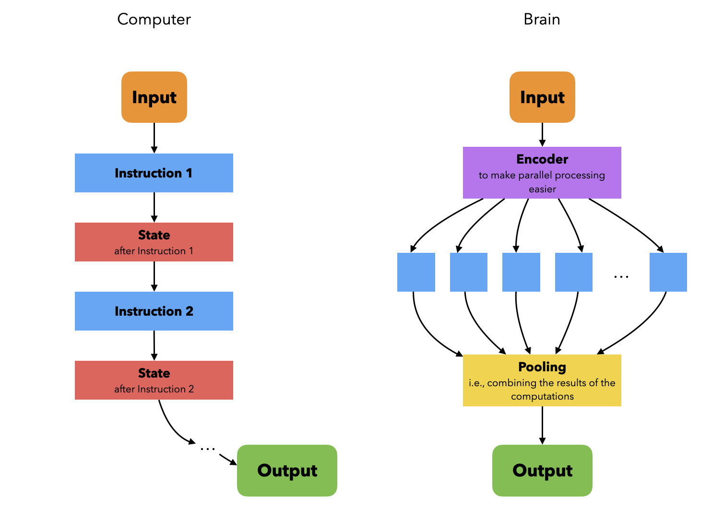
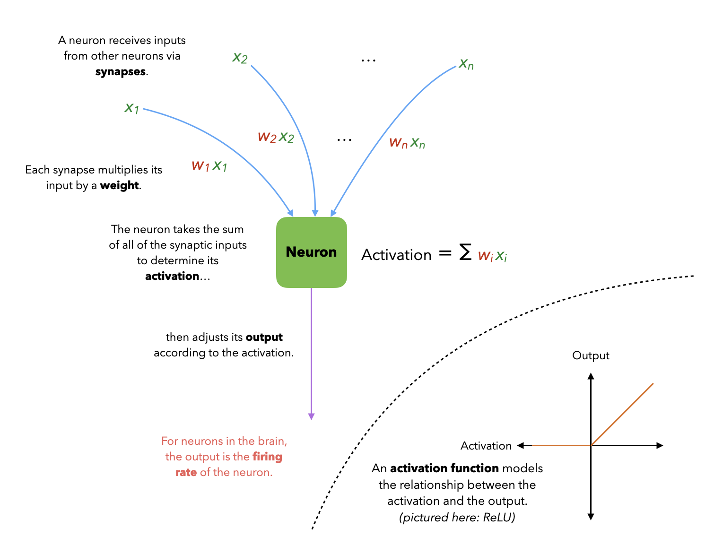
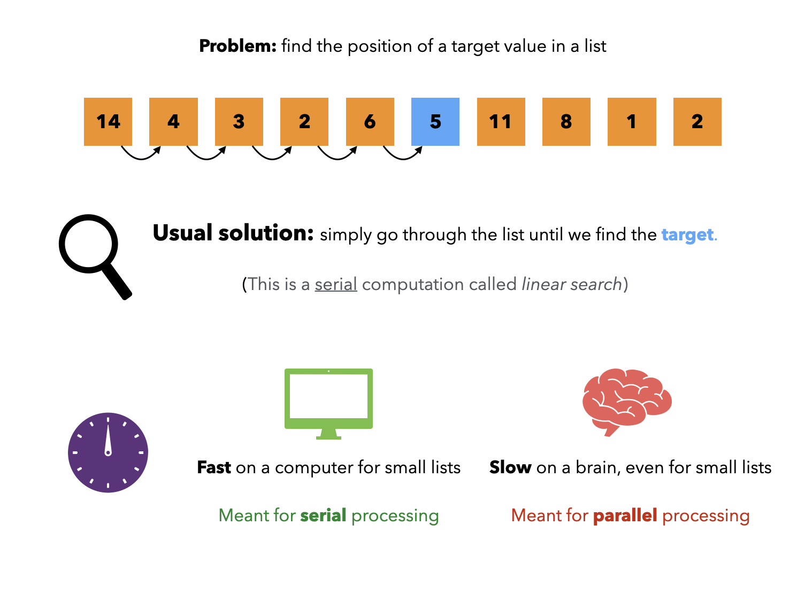
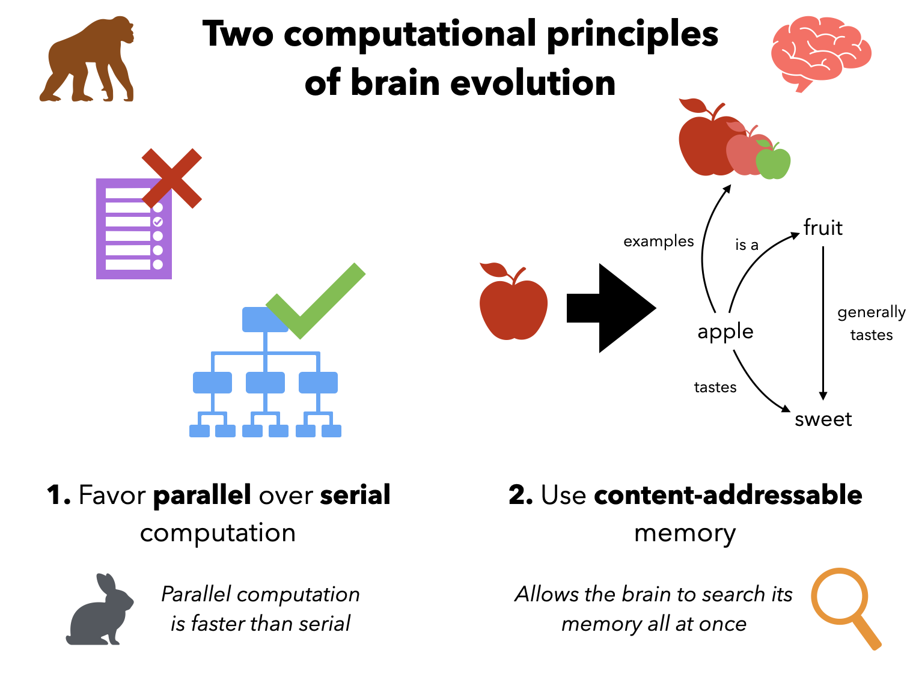
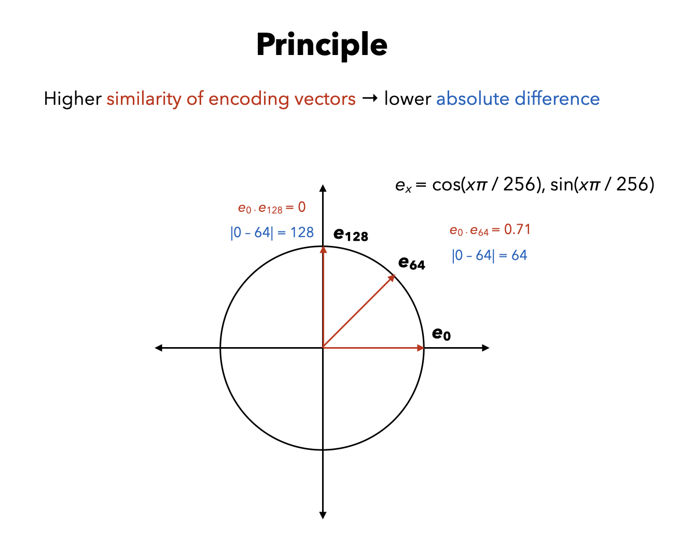

*If you haven't already, see [my previous post](https://dualcoding.net/neural-networks-part-1/) for the basic idea behind neural networks.*

When we study the brain, we like to forget that it isn't a typical computer. We can't just pretend the brain implements a von Neumann architecture that performs its computations serially. If the brain performed one computation at a time, then we'd barely even be alive! That's because the brain is absolutely sluggish compared to a computer – while a computer only uses fast electrical signals, the brain has to also use slow chemical signals. While we talk about how many GHz a modern CPU runs at, a neuron fires at 200Hz if we're lucky. 

But the brain has a trick up its sleeve – it runs its computations **in parallel** as much as possible. To do so, it represents data in a way so that the operations we want to do on it are **linear**: we can break a big computation into many smaller computations, then simply sum the results together. Specifically, if we have some data, we can represent it as a vector $\mathbf{x} = (x\_1, \dots, x\_n)$. How we encode the data as a vector depends on the problem we're trying to solve: the right encoding will make computations a breeze.

When we say a computation $f$ is linear, that just means we can break it into $n$ smaller computations $f\_1, \dots, f\_n$ on each component $x\_1, \dots, x\_n$:

$$
f(\mathbf{x}) = f_1(x_1) + \dots + f_n(x_n)
$$

Linear computations are parallel computations too: instead of a single thread carrying all of the load, we can distribute  the smaller computations to multiple threads, and then simply take the sum of those computations. Addition is cheap, so the final step is blazing fast. 

In the brain, each neuron performs a linear computation to determine its output, multiplying an input by the weight of the synapse receiving it. Many **learning** processes change the weights of the synapses, allowing a neuron to represent a variety of linear computations.

On the other hand, we don't know of an obvious way to perform many computations in parallel, let alone linearly. But often, we can find a clever way to encode the inputs and outputs of our computation so that our computation is now easy to do in parallel. That is why much of our brain consists of **perceptual** regions: they encode our sensory input to make it easier for the rest of the brain to process.

Let's go over an example of how a clever encoding allows us to replace a serial computation with a parallel one!

### The scenario

Suppose we have an list of values and we merely want to see whether a target value is in that list. On a computer, we'd have to use linear search, which processes elements of the list in series until it finds the target or reaches the end of the list. Luckily, if the list is small, then the computer can do it without a hitch. It helps that since is arranged contiguously in memory, this **linear search** is even faster thanks to the CPU cache – a sign that computers were designed for serial processing.

But on a brain, linear search would be hideously slow! The 200Hz figure I gave is only the peak *firing rate* of a neuron, which isn't the same as a CPU clock cycle. A neuron adjusts its firing rate to convey information, since a neuron must either fire at full strength or not at all (the all-or-nothing principle, which is a pretty fitting name if you ask me). It would take way longer than 5ms for a neuron to determine the firing rate of an input neuron if that neuron fires slowly. Furthermore, as anyone with a brain would know, the brain is *terrible* at short-term memory. To maintain a certain state representing what we want to store in short-term memory, the brain uses recurrent neural networks that *in theory* converge to that state (I will go over the details later). With such an ad hoc solution prone to interference, we shouldn't be surprised that a computer's RAM dwarfs a brain's short-term memory.

### Evolution, the engineer

In light of those troubles, evolution made two tradeoffs to ensure the brain could actually run.

First, evolution sculpted the brain to **avoid serial computation** as much as possible. Remember that linear computations are easy to parallelize: we can break them into many smaller computations, then simply sum their results to get the overall result. It's no coincidence that we use a lot of linear algebra in deep learning: the brain literally uses linear computations, so it can use parallel instead of serial computation.

Second, evolution favored **content-addressable** memory structures – instead of a separate address being the key for accessing data, now the data is its own key. Thanks to content-addressable memory, the brain can access large chunks of memory all at once, so it acts more like a search engine than a phonebook. We do lose the ability to refer to a specific memory address, but that doesn't matter as much when we are computing things in parallel. It's only vital in serial processing, where we have to perform a specific sequence of computations to precise memory locations. In the von Neumann architecture, programs and data are stored in the same memory, and we *especially* don't want to run the wrong program!

As a cherry on top, we can usually run parallel computations without storing mutable states (like pointers and intermediate computations). 

So keeping those principles in mind, how could we solve the problem in our scenario? How can a neural network represent a list $a\_1, \dots, a\_n$ so that we can search for the location of a target $t$? We would first want to represent the input (the target $t$) and output (the index $i$ such that $a\_i = t$) so that we can easily solve our problem in parallel.

### No computation without representation

In a hidden layer with $h$ neurons $1, \dots, h$, each neuron $i$ has a weight vector $\mathbf{w}\_i$. It takes the input vector $\mathbf{x}$ and computes the dot product $\mathbf{w}\_i \cdot \mathbf{x}$ which represents the **similarity** between $\mathbf{w}\_i$ and $\mathbf{x}$. Consider that

$$
\mathbf{w}_i \cdot \mathbf{x} = \|\mathbf{w}_i\| \|\mathbf{x}\| \cos(\theta)
$$

where $\theta$ is the angle between the two vectors. When they are both unit vectors, we simply have

$$
\mathbf{w}_i \cdot \mathbf{x} = \cos(\theta)
$$

From $0$ to $\pi$ radians (two right angles), $\cos(\theta)$ is decreasing, so the vectors are most similar when they point in the same direction, and least similar when they point in opposite directions. In this case, we call the dot product of those vectors their **cosine similarity**.

We want to determine what the possible values in our list $a\_1, \dots, a\_n$ are. Let's say it can only have values between $0$ and $256$ (inclusive). Then, we could encode a single value $x$ as a vector on the unit circle:

$$
x \text{ is represented as } (\cos(x \pi/256), \sin(x \pi/256))
$$

We will denote the encoding vector of $x$ as $\mathbf{e}\_{x}$. If we plot all values of $x$ on the circle, you'll notice that

- the difference between two values is correlated with the angle $\theta$ between their encoding vectors, and so the cosine of the angle $\cos(\theta)$ as well.
- $\mathbf{e}\_{0}$ and $\mathbf{e}\_{256}$ sit opposite from each other, meaning their similarity is as low as it can get: $\mathbf{e}\_0 \cdot \mathbf{e}\_{256} = -1$.

We can represent the list $a\_1, \dots, a\_n$ as a neural network with $2$-dimensional inputs and $n$ neurons $1, \dots, n$. The input is the encoding $\mathbf{e}\_t$ of the target $t$. Then, we set the weight vector $\mathbf{w}\_i$ of the $i$th neuron to the encoding vector $\mathbf{e}\_{a\_i}$ of $a\_i$. We can shove all these weight vectors into a weight matrix

$$
W = \begin{pmatrix}
\mathbf{w}_1 \\
\vdots \\
\mathbf{w}_n
\end{pmatrix} = \begin{pmatrix}
\mathbf{e}_{a_1} \\
\vdots \\
\mathbf{e}_{a_n}
\end{pmatrix}
$$

Here, the idea is that the neuron $i$ detects how similar the target $t$ is to the value $a\_i$ via the dot product $\mathbf{e}\_t \cdot \mathbf{w}\_i = \mathbf{e}\_t \cdot \mathbf{e}\_{a\_i}$. Remember that our problem in the first place was to search for $t$, so when the dot product is $1$, that precisely means we have $a\_i = t$ – exactly what we were looking to check! If we use the activation function 

$$
f(x) = \begin{cases}
1 &\text{if $x \geq 1$} \\
0 &\text{otherwise}
\end{cases}
$$

this means that the $i$th neuron will yield the value $1$ whenever $a\_i = t$, and $0$ otherwise. In the end, after computing the output vector $\mathbf{y} = f(W\mathbf{x}) = (y\_1, \dots, y\_n)$, we get a vector of $1$s and $0$s. The indices $i$ where $a\_i = t$ are simply those where $y\_i = t$.

---

For example, if our list is $0, 64, 128, 192, 256$, then we have the weight matrix

$$
W = \begin{pmatrix}
1 & 0 \\
\frac{\sqrt{2}}{2} & \frac{\sqrt{2}}{2} \\
0 & 1 \\
-\frac{\sqrt{2}}{2} & \frac{\sqrt{2}}{2} \\
- 1 & 0
\end{pmatrix}
$$

Setting our target to $128$, we have

$$
W\mathbf{e}_{128} = \begin{pmatrix}
1 & 0 \\
\frac{\sqrt{2}}{2} & \frac{\sqrt{2}}{2} \\
0 & 1 \\
-\frac{\sqrt{2}}{2} & \frac{\sqrt{2}}{2} \\
- 1 & 0
\end{pmatrix} \begin{pmatrix}
0 & 1
\end{pmatrix} = \begin{pmatrix}
0 \\
\frac{\sqrt{2}}{2} \\
1 \\
\frac{\sqrt{2}}{2} \\
0
\end{pmatrix}
$$

And passing it to our activation function $f$ described above, we get the output vector
$$
f(W\mathbf{e}_{x}) = \begin{pmatrix}
0 \\
0 \\
1 \\
0 \\
0
\end{pmatrix}
$$

Indeed, $128$ matches the third element of our list, and only the third element of the output vector is a $1$ with the rest being $0$s.

Sometimes, we want to relate our target $t$ to other elements in the list, even if $t$ is not in the list itself. We could use a softer activation function that emits a positive output even when we don't have an exact match. For example, we could use ReLU activation: $f(x) = \max(0, x)$. This means that neuron $i$ would output the similarity $\mathbf{e}\_{t} \cdot \mathbf{e}\_{a\_i}$ as long as the absolute difference between $t$ and $a\_i$ is less than $128$, otherwise clamping it to $0$. If our target is $32$ in this case, we'd have before activation

$$
W\mathbf{e}_{32} \approx \begin{pmatrix}
1 & 0 \\
\frac{\sqrt{2}}{2} & \frac{\sqrt{2}}{2} \\
0 & 1 \\
-\frac{\sqrt{2}}{2} & \frac{\sqrt{2}}{2} \\
- 1 & 0
\end{pmatrix} \begin{pmatrix}
0.924 & 0.383 
\end{pmatrix} = \begin{pmatrix}
0.924 \\
0.924 \\
0.383 \\
-0.383 \\
-0.924
\end{pmatrix}
$$

and after activation

$$
f(W\mathbf{e}_{32}) = \begin{pmatrix}
0.924 \\
0.924 \\
0.383 \\
0 \\
0
\end{pmatrix}
$$

So we can see that $32$ is equally close to $0$ and $64$, and vaguely close to $0.383$, but too far away from $192$ and $256$ for their neurons to be activated.

Nonetheless, we've taken a problem that we usually solve with serial computation via linear search, and showed that we can just as well use parallel computation! Instead of doing it the boring way, we represented the inputs and outputs so that we could simply compute dot products to see whether a list element is equal to (or similar to) a target. Since each neuron computes a dot product, and every linear map can be represented as a sum of independent dot products, the algorithm is linear. A brain could actually find the answer using this algorithm before the heat death of the universe!
